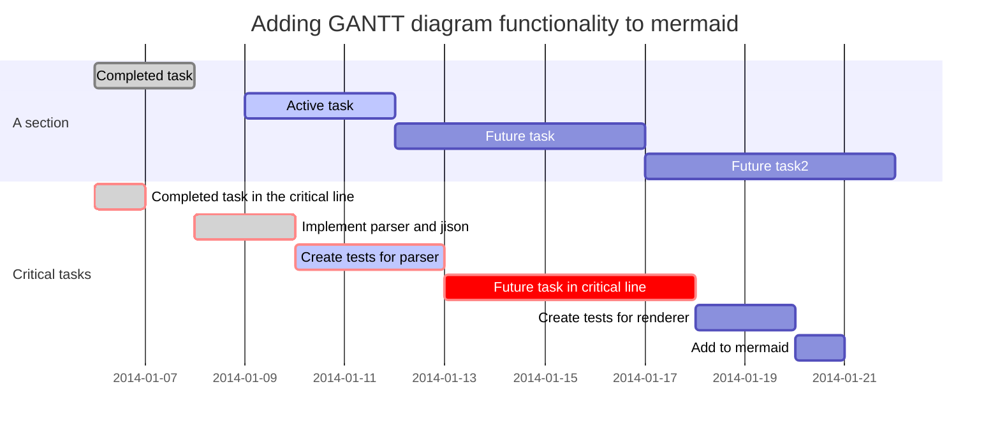

#Typora编辑器，使用Markdown语法

##1. 基本语法：

## 2. 数学公式的输入

MathJax是一款相当强悍的在网页显示数学公式的插件。本教程介绍MathJax如何使用LaTeX语法编写数学公式。

1．如何插入公式

LaTeX的数学公式有两种：行中公式和独立公式。行中公式放在文中与其它文字混编，独立公式单独成行。

行中公式可以用如下两种方法表示：

＼(数学公式＼)　或　￥数学公式￥（要把人民币符号换成美元符号）

独立公式可以用如下两种方法表示：

＼[数学公式＼]　或　￥￥数学公式￥￥（要把人民币符号换成美元符号）

例子：＼[J*\alpha(x) = \sum*{m=0}^\infty \frac{(-1)^m}{m! \Gamma (m + \alpha + 1)} {\left({ \frac{x}{2} }\right)}^{2m + \alpha}＼]

显示： 

2．如何输入上下标

^表示上标, _表示下标。如果上下标的内容多于一个字符，要用{}把这些内容括起来当成一个整体。上下标是可以嵌套的，也可以同时使用。

例子：x^{y^z}=(1+{\rm e}^x)^{-2xy^w}

显示： 

另外，如果要在左右两边都有上下标，可以用\sideset命令。

例子：\sideset{^1*2}{^3*4}\bigotimes

显示： 

3．如何输入括号和分隔符

()、[]和|表示自己，{}表示{}。当要显示大号的括号或分隔符时，要用\left和\right命令。

例子：f(x,y,z) = 3y^2z \left( 3+\frac{7x+5}{1+y^2} \right)

显示： 

有时候要用\left.或\right.进行匹配而不显示本身。

例子：\left. \frac{{\rm d}u}{{\rm d}x} \right| _{x=0}

显示： 

4．如何输入分数

例子：\frac{1}{3}　或　1 \over 3

显示：  　或 

5．如何输入开方

例子：\sqrt{2}　和　\sqrt[n]{3}

显示：  　和　 ![\sqrt[n]{3}](https://oiltang.com/wp-content/plugins/latex/cache/tex_85c4c5e6445b3c0837414b0ae0adb6c4.gif)

6．如何输入省略号

数学公式中常见的省略号有两种，\ldots表示与文本底线对齐的省略号，\cdots表示与文本中线对齐的省略号。

例子：f(x*1,x*2,\ldots,x*n) = x*1^2 + x*2^2 + \cdots + x*n^2

显示： 

7．如何输入矢量

例子：\vec{a} \cdot \vec{b}=0

显示： 

8．如何输入积分

例子：\int_0^1 x^2 {\rm d}x

显示： 

9．如何输入极限运算

例子：\lim_{n \rightarrow +\infty} \frac{1}{n(n+1)}

显示： 

10．如何输入累加、累乘运算

例子：\sum*{i=0}^n \frac{1}{i^2}　和　\prod*{i=0}^n \frac{1}{i^2}

显示：  　和　 

11．如何进行公式应用

先要在［mathjax］后添加：

＜script type="text/x-mathjax-config"＞ MathJax.Hub.Config({ TeX: {equationNumbers: { autoNumber: ["AMS"], useLabelIds: true}}, "HTML-CSS": {linebreaks: {automatic: true}}, SVG: {linebreaks: {automatic: true}} }); ＜/script＞

例子：＼begin{equation}\label{equation1}r = r*F+ \beta(r*M – r_F) + \epsilon＼end{equation}

显示：\begin{equation}\label{equation1}r = r*F+ \beta(r*M – r_F) + \epsilon\end{equation}

引用：请见公式(  )

12．如何输入希腊字母

例子： \alpha　A　\beta　B　\gamma　\Gamma　\delta　\Delta　\epsilon　E \varepsilon　　\zeta　Z　\eta　H　\theta　\Theta　\vartheta \iota　I　\kappa　K　\lambda　\Lambda　\mu　M　\nu　N \xi　\Xi　o　O　\pi　\Pi　\varpi　　\rho　P \varrho　　\sigma　\Sigma　\varsigma　　\tau　T　\upsilon　\Upsilon \phi　\Phi　\varphi　　\chi　X　\psi　\Psi　\omega　\Omega

显示：      

  　     　

     　   

 　   　  　   　

   　    

 　  　    　  

13．如何输入其它特殊字符

关系运算符：  ：\pm

 ：\times

 ：\div

 ：\mid

 ：\nmid

 ：\cdot

 ：\circ

 ：\ast

 ：\bigodot

 ：\bigotimes

 ：\bigoplus

 ：\leq

 ：\geq

 ：\neq

 ：\approx

 ：\equiv

 ：\sum

 ：\prod

 ：\coprod

集合运算符：  ：\emptyset

 ：\in

 ：\notin

 ：\subset

 ：\supset

 ：\subseteq

 ：\supseteq

 ：\bigcap

 ：\bigcup

 ：\bigvee

 ：\bigwedge

 ：\biguplus

 ：\bigsqcup

对数运算符：  ：\log

 ：\lg

 ：\ln

三角运算符：  ：\bot

 ：\angle

 ：30^\circ

 ：\sin

 ：\cos

 ：\tan

 ：\cot

 ：\sec

 ：\csc

微积分运算符：  ：\prime

 ：\int

 ：\iint

 ：\iiint

 ：\iiiint

 ：\oint

 ：\lim

 ：\infty

 ：\nabla

逻辑运算符：  ：\because

 ：\therefore

 ：\forall

 ：\exists

 ：\not=

 ：\not>

 ：\not\subset

戴帽符号：  ：\hat{y}

 ：\check{y}

 ：\breve{y}

连线符号：  ：\overline{a+b+c+d}

 ：\underline{a+b+c+d}

 ：\overbrace{a+\underbrace{b+c}{1.0}+d}^{2.0}

箭头符号：  ：\uparrow

 ：\downarrow

 ：\Uparrow

 ：\Downarrow

 ：\rightarrow

 ：\leftarrow

 ：\Rightarrow

 ：\Leftarrow

 ：\longrightarrow

 ：\longleftarrow

 ：\Longrightarrow

 ：\Longleftarrow

要输出字符　空格　#　$　%　&　_　{　}　，用命令：　\空格　#　\$　\%　\&　_　{　}

14．如何进行字体转换

要对公式的某一部分字符进行字体转换，可以用{\rm 需转换的部分字符}命令，其中\rm可以参照下表选择合适的字体。一般情况下，公式默认为意大利体。 \rm　　罗马体　　　　　　　\it　　意大利体 \bf　　黑体　　　　　　　　\cal 　花体 \sl　　倾斜体　　　　　　　\sf　　等线体 \mit 　数学斜体　　　　　　\tt　　打字机字体 \sc　　小体大写字母

##3. 绘图工具：

Markdown有绘图的语法，但较为复杂，mermaid解决这个痛点，这是一个类似markdown语法的脚本语言，通过JavaScript实现图表的生成。Typora支持mermaid语法。

[mermaid官方网址](https://mermaidjs.github.io/)

流程图基本语法：

甘特图：

等